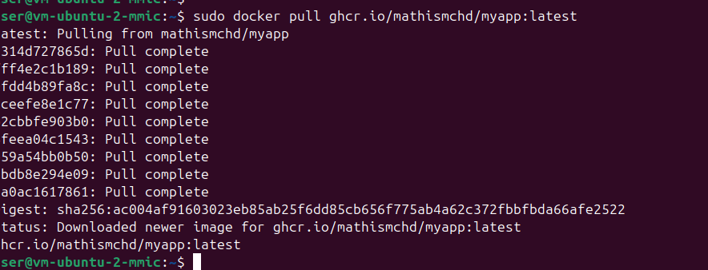

# Infra DevOps - Docker Swarm
### Mathis MICHENAUD - ESGI IW Nantes - 2026 

# Status
[](https://github.com/MathisMchd/ESGI_InfraDevops_DockerSwarm/actions/workflows/main.yml)


# Partie A — API Node.js
## Comment récupérer le hostname dans Node.js ?

Utiliser le module natif `os` qui permet de récupérer le hostname :

```js
import os from "os";

const hostname = os.hostname();
console.log(hostname);
```

## Différence entre localhost et 0.0.0.0 dans un conteneur

 - `localhost` : écoute uniquement dans le conteneur, non accessible depuis l'hôte, on ne peut pas redéfinir le port avec `docker run -p 3000:3000` par exemple.

 - `0.0.0.0` : accessible depuis l'extérieur du conteneur, port redéfinissable (`docker run -p 3000:3000`)


# Partie B — Conteneurisation Docker

## Quels fichiers doivent absolument être ignorés ? Pourquoi ?

À ignorer dans `.dockerignore` :

- `node_modules` → reconstruit dans l'image, évite conflits d’OS
- `.git` → inutile et evite la fuite de l'historique
- `tests` / `coverage` →  inutiles
- `.env*` → secrets potentiellement exposés
- `README.md` → pas nécessaire
- `.vscode` / `.idea` → configs locales pas nécessaire
- `logs` → inutiles et volumineux + risque fuite de données si on maitrise pas les logs
- `Dockerfile` / `.dockerignore` → inutiles dans l’image finale

Objectifs :
- réduire la taille de l’image
- éviter fuite de secrets
- utiliser au maximum le cache Docker


## Comment valider que l'image finale ne contient pas d’artefacts de dev ?

### 1. Inspecter le contenu du conteneur

```bash
docker run --rm -it mon-image sh
```

### 2. Vérifier 
```bash
npm ls --dev
```


# Partie C — Registry d’images

## Quelle stratégie de tags adoptez-vous : latest, SHA, semver ?


Vu que c'est du dev rapide là cela sera latest, mais sinon en temps normal pour une version pro il faut utiliser des tags immuables comme le SHA du commit ou des versions semver (ex: 1.0.0), afin de garantir des déploiements reproductibles, traçables et sans surprise en production.


## Pourquoi un tag immuable est préférable pour un déploiement fiable ?

Un tag immuable (SHA ou version) est préférable car il garantit que l’image déployée ne change jamais.
Les déploiements sont reproductibles, traçables et sans effet de surprise car la version ne change pas.


Je pull bien : 




# Partie D — Accès distant au cluster Swarm

## Pourquoi exposer Docker en TCP sans TLS est dangereux ?

Exposer Docker en TCP sans TLS est dangereux car si un attaquant à accès au port Docker il peut :
- exécuter des commandes
- lancer des conteneurs arbitraires
- accéder aux fichiers du système via des volumes


## Différence entre “le runner atteint le manager” et “le manager atteint le runner”

### Runner → Manager (pull model)
- GitHub Actions (runner) se connecte à la VM (manager)
- Le déploiement est initié depuis CI
- Nécessite accès SSH / API côté manager

C'est plus simple car la VM "ne bouge pas" et les changements viennent de github la ou e passe la CI/CD 

### Manager → Runner (push model)
- La VM (manager) doit contacter le runner GitHub
- Plus complexe car les runners sont éphémères


